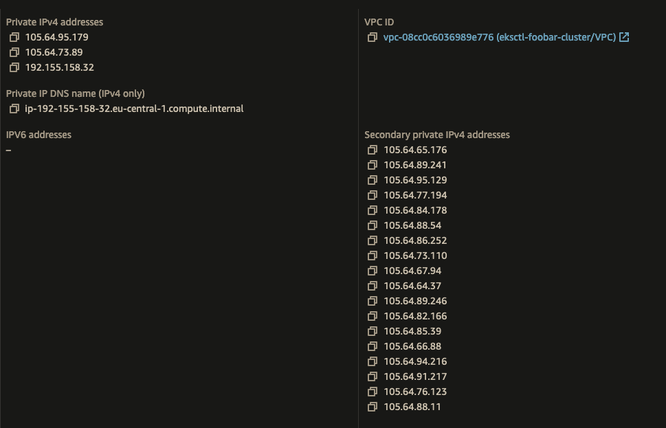

# EKS Custom Newtworking w/ VPC Secondary CIDR

- This configuration **keeps nodes and pods IP addresses in the different CIDR blocks**.
- AWS VPCs has a default CIDR block, and you can add a secondary CIDR block to the VPC.
- We will use the secondary CIDR block for the pods, and the default CIDR block for the nodes.
    - Secondary CIDR will have `/19` mask so for 3 subnets we can have available IP count of `3*8190` or `24570` for our pods.
- This tutorial also includes karpenter configuration for make use of the secondary CIDR block.

## Prerequisites
- jq
- eksdemo
- yq
- kubectl
- aws cli 

## Hands-on

### Export Variables

```bash
export AWS_PAGER=""  # disable the aws cli pager 
export AWS_PROFILE=hepapi
export AWS_REGION=eu-central-1
export CLUSTER_NAME="toto"
export CLUSTER_VPC_CIDR="192.151.0.0/16"
export SECONDARY_CIDR_BLOCK="110.64.0.0/16"
export AZ1_CIDR="110.64.0.0/19"
export AZ2_CIDR="110.64.32.0/19"
export AZ3_CIDR="110.64.64.0/19"
export AZ1="eu-central-1a"
export AZ2="eu-central-1b"
export AZ3="eu-central-1c"
export NODEGROUP_NAME="managed-nodes"
```

### Create eksdemo EKS cluster
```bash
eksdemo create cluster "$CLUSTER_NAME" \
    --instance "m5.large" \
    --nodes 1 \
    --version "1.24" \
    --os "AmazonLinux2" \
     --vpc-cidr "$CLUSTER_VPC_CIDR"

# get the cluster info from eksdemo
eksdemo get cluster "$CLUSTER_NAME"


# make sure to use the correct context
eksdemo use-context "$CLUSTER_NAME"

kubectl config current-context

kubectl get pod -A
kubectl get nodes -o wide
```

### Create Secondary VPC CIDR

#### Export VPC Info
```bash
export VPC_ID=$(aws eks describe-cluster --name "$CLUSTER_NAME" --query "cluster.resourcesVpcConfig.vpcId" --output text)

echo "VPC ID: ${VPC_ID:-'ERROR: should have VPC_ID, fix before continuing'}"

export VPC_NAME=$(aws ec2 describe-vpcs --vpc-ids "$VPC_ID" --query 'Vpcs[].Tags[?Key==`Name`].Value' --output text)

echo "VPC_NAME: ${VPC_NAME:-'ERROR: should have VPC_NAME, fix before continuing'}"

export CLUSTER_SECURITY_GROUP_ID=$(aws eks describe-cluster --name "$CLUSTER_NAME" --query cluster.resourcesVpcConfig.clusterSecurityGroupId --output text)
echo "EKS Cluster($CLUSTER_NAME) has Security Group ID: ${CLUSTER_SECURITY_GROUP_ID:-'ERROR: should have CLUSTER_SECURITY_GROUP_ID, fix before continuing'}"

```

#### Associate Secondary CIDR Block to VPC
```bash
echo "\nCurrent Subnets:"
aws ec2 describe-subnets --filters "Name=vpc-id,Values=$VPC_ID" \
    --query 'Subnets[*].{SubnetId: SubnetId,AvailabilityZone: AvailabilityZone,CidrBlock: CidrBlock}' \
    --output table

# Associate a secondary CIDR block with the cluster VPC
echo "\nAssociating secondary CIDR block: $SECONDARY_CIDR_BLOCK with VPC: $VPC_NAME($VPC_ID)"
aws ec2 associate-vpc-cidr-block --vpc-id "$VPC_ID" --cidr-block "$SECONDARY_CIDR_BLOCK" --no-cli-pager


# see the created associations as a table
echo "\n$VPC_NAME($VPC_ID) VPC has associations:"
aws ec2 describe-vpcs --vpc-ids "$VPC_ID" \
    --query 'Vpcs[*].CidrBlockAssociationSet[*].{CIDRBlock: CidrBlock, State: CidrBlockState.State}' --out table

```

#### Create Subnets in the Secondary CIDR Block
```bash
# Control the variables before creating the subnets
echo "Provided Vars (for later export):\nexport AZ1=$AZ1\nexport AZ2=$AZ2\nexport AZ3=$AZ3\nexport AZ1_CIDR=$AZ1_CIDR\nexport AZ2_CIDR=$AZ2_CIDR\nexport AZ3_CIDR=$AZ3_CIDR\n"

# create the subnets
echo "Creating Subnets on AZs: $AZ1, $AZ2 and $AZ3"
export CUST_SNET1=$(aws ec2 create-subnet --cidr-block "$AZ1_CIDR" --vpc-id "$VPC_ID" --availability-zone "$AZ1" | jq -r .Subnet.SubnetId)
export CUST_SNET2=$(aws ec2 create-subnet --cidr-block "$AZ2_CIDR" --vpc-id "$VPC_ID" --availability-zone "$AZ2" | jq -r .Subnet.SubnetId)
export CUST_SNET3=$(aws ec2 create-subnet --cidr-block "$AZ3_CIDR" --vpc-id "$VPC_ID" --availability-zone "$AZ3" | jq -r .Subnet.SubnetId)

echo -e "Created Subnets:\nexport CUST_SNET1=$CUST_SNET1 # ($AZ1_CIDR)\nexport CUST_SNET2=$CUST_SNET2 # ($AZ2_CIDR)\nexport CUST_SNET3=$CUST_SNET3 # ($AZ3_CIDR)"

# do this if associated to Public Route table
# Enable auto-assign public IPv4 addresses
# aws ec2 modify-subnet-attribute --subnet-id "$CUST_SNET1" --map-public-ip-on-launch 
# aws ec2 modify-subnet-attribute --subnet-id "$CUST_SNET2" --map-public-ip-on-launch 
# aws ec2 modify-subnet-attribute --subnet-id "$CUST_SNET3" --map-public-ip-on-launch 


echo "VPC Subnets after Secondary CIDR has been populated with 3 subnets:"
aws ec2 describe-subnets --filters "Name=vpc-id,Values=$VPC_ID" \
    --query 'Subnets[*].{SubnetId: SubnetId,AvailabilityZone: AvailabilityZone,CidrBlock: CidrBlock}' \
    --output table
```


#### Route Table Configuration
```bash
# Find the RouteTableID of the main route table
export MAIN_ROUTE_TABLE_ID=$(aws ec2 describe-route-tables \
    --filters "Name=route.destination-cidr-block,Values=${SECONDARY_CIDR_BLOCK}"  "Name=association.main,Values=true" \
    --query 'RouteTables[].RouteTableId' --output text)

echo "Routes of RouteTable w/ ID: ${MAIN_ROUTE_TABLE_ID:-'MAIN_ROUTE_TABLE_ID variable should have a value of route-table-id, fix before continuing...'}"
aws ec2 describe-route-tables --route-table-ids "$MAIN_ROUTE_TABLE_ID" --query 'RouteTables[].Routes[]' --output table


# aws ec2 associate-route-table --route-table-id $MAIN_ROUTE_TABLE_ID --subnet-id $CUST_SNET1
# aws ec2 associate-route-table --route-table-id $MAIN_ROUTE_TABLE_ID --subnet-id $CUST_SNET2
# aws ec2 associate-route-table --route-table-id $MAIN_ROUTE_TABLE_ID --subnet-id $CUST_SNET3


# Find a (the first) NATGW ID in the VPC
export FIRST_NATGW_ID=$(aws ec2 describe-nat-gateways \
    --filter "Name=vpc-id,Values=${VPC_ID}" \
    --query 'NatGateways[0].NatGatewayId' --output text 2>&1)

echo "Found (first) NATGW ID: ${FIRST_NATGW_ID:-'FIRST_NATGW_ID variable should have a value, fix before continuing...'}"


# create a route in the MAIN_ROUTE_TABLE_ID and at 0.0.0.0/0 with the FIRST_NATGW_ID. Description: "Route to secondary CIDR block"
echo "Creating NATGW route in RouteTable(${MAIN_ROUTE_TABLE_ID})"
natgw_route_has_created=$(aws ec2 create-route \
    --route-table-id "$MAIN_ROUTE_TABLE_ID" \
    --destination-cidr-block "0.0.0.0/0" \
    --nat-gateway-id "$FIRST_NATGW_ID" --output text)
echo "In RouteTable(${MAIN_ROUTE_TABLE_ID}), created a route at 0.0.0.0/0 to NATGW(${FIRST_NATGW_ID}): $natgw_route_has_created"

aws ec2 describe-route-tables --route-table-ids "$MAIN_ROUTE_TABLE_ID" --query 'RouteTables[].Routes[]' --output table

```

#### Tagging the Resources properly

- `Karpenter AWSNodeTemplate` objects select the Subnets and Security Groups based on the `karpenter.sh/discovery` tag.
    ```yaml
    kind: AWSNodeTemplate
    spec:
        subnetSelector: 
            karpenter.sh/discovery: "${CLUSTER_NAME}"        
        securityGroupSelector: 
            karpenter.sh/discovery: "${CLUSTER_NAME}"
    ```
- The tags that start with `kubernetes.io/*` are required, and the ones that start with `alpha.eksctl.io/` are only applied when you create it with eksctl.
- For `kubernetes.io/role/*` tag, follow the below rules:
    - Public Subnets: `kubernetes.io/role/elb,Value=1`
    - Private Subnets: `kubernetes.io/role/internal-elb,Value=1`


```bash
existing_node_group_subnets=$(aws eks describe-nodegroup \
  --cluster-name "${CLUSTER_NAME}" \
  --nodegroup-name "${NODEGROUP_NAME}" \
  --query 'nodegroup.subnets' \
  --output text | cat -s \
  | awk -F'\t' '{for (i = 1; i <= NF; i++) print $i}')

echo "Existing Node Group Subnets: \n${existing_node_group_subnets:-'ERROR: should have existing_node_group_subnets, fix before continuing'}"
# Use a for loop to iterate through the lines and echo them

while IFS=$'\t' read -r subnet_id ; do
    # echo "${subnet_id}"
    echo "Tagging Subnet: $subnet_id of EKS Cluster: $CLUSTER_NAME + NodeGroup: $NODEGROUP_NAME"
    aws ec2 create-tags --resources "$subnet_id" --tags \
    "Key=karpenter.sh/discovery,Value=${CLUSTER_NAME}"
done <<< $existing_node_group_subnets


```


```bash
aws ec2 create-tags --resources "$CUST_SNET1" --tags \
    "Key=Name,Value=SecondarySubnet-A-${CLUSTER_NAME}" \
    "Key=kubernetes.io/role/internal-elb,Value=1" \
    "Key=alpha.eksctl.io/cluster-name,Value=${CLUSTER_NAME}" \
    "Key=kubernetes.io/cluster/${CLUSTER_NAME},Value=shared"

aws ec2 create-tags --resources "$CUST_SNET2" --tags \
    "Key=Name,Value=SecondarySubnet-B-${CLUSTER_NAME}" \
    "Key=kubernetes.io/role/internal-elb,Value=1" \
    "Key=alpha.eksctl.io/cluster-name,Value=${CLUSTER_NAME}" \
    "Key=kubernetes.io/cluster/${CLUSTER_NAME},Value=shared"

aws ec2 create-tags --resources "$CUST_SNET3" --tags \
    "Key=Name,Value=SecondarySubnet-C-${CLUSTER_NAME}" \
    "Key=kubernetes.io/role/internal-elb,Value=1" \
    "Key=alpha.eksctl.io/cluster-name,Value=${CLUSTER_NAME}" \
    "Key=kubernetes.io/cluster/${CLUSTER_NAME},Value=shared"


aws ec2 create-tags --resources "$CLUSTER_SECURITY_GROUP_ID" --tags \
    "Key=karpenter.sh/discovery,Value=${CLUSTER_NAME}" \
    "Key=alpha.eksctl.io/cluster-name,Value=${CLUSTER_NAME}" \
    "Key=kubernetes.io/cluster/${CLUSTER_NAME},Value=owned"

```

### AWS-Node and CNI Configuration
```bash
# Get the current env vars of aws-node
kubectl get daemonset aws-node -n kube-system -o jsonpath='{.spec.template.spec.containers[0].env}' | jq -r '.[] | .name + "=" + .value'

# Enable custom network config in aws-node
kubectl set env daemonset aws-node -n kube-system AWS_VPC_K8S_CNI_CUSTOM_NETWORK_CFG=true

kubectl set env daemonset aws-node -n kube-system ENI_CONFIG_LABEL_DEF=topology.kubernetes.io/zone

```
####  Environment Variables Explained

- `kube-system ENI_CONFIG_LABEL_DEF=topology.kubernetes.io/zone`: 
    - Means that AWS CNI is using the _topology.kubernetes.io/zone_ label to determine the `ENIConfig` name(`kubectl get eniconfig`) for that node. 
    - _topology.kubernetes.io/zone_ label is automatically added to the nodes by the kubelet as `eu-west-1a` or `eu-west-1b` or `eu-west-1c`, so we don't need any extra node tagging to do.
    - This way we have a consistent way of applying the ENIConfig to the nodes.
    - `ENIConfig` has the info about which Subnet and Security Groups should be used for the ENI.
    - Our nodes will have their 1st ENI configured with the default VPC CIDR block, and the 2nd ENI will be configured with the Secondary CIDR block.
    - Pods get their IPs from 2nd ENI, and the 1st ENI is used for the node communication.
    - We will have 1st ENI reserved for pods, and all other ENIs will be used for the pod communication and in the Secondary CIDR block.
- `AWS_VPC_K8S_CNI_CUSTOM_NETWORK_CFG=true`: 
    - AWS CNI will use the `ENIConfig` objects which we create to configure the ENIs.
    - Means that we are enabling custom networking on the CNI level. This change will help us to use the secondary CIDR block for the pods.
    - This configuration **requires the existing node EC2 Instances be be restarted to take effect**.

### ENIConfig k8s CRDs
- ENIConfig CRD is used by AWS CNI to create ENIs with the specified configuration for that Availability Zone.
- The deamonset `aws-node` has env. var. called `ENI_CONFIG_LABEL_DEF`, and it is used to match
    ```
    Node Labels:
        topology.kubernetes.io/zone=eu-west-1a
        ...

    AWS CNI makes the following configuration 
        (selected ENIConfig name for node) = NodeLabels[ENI_CONFIG_LABEL_DEF]
    ```
- We are informing AWS CNI to look for the node label `topology.kubernetes.io/zone`. 
    - For example, if the label value is `eu-west-1a`, AWS CNI will use the `ENIConfig` named `eu-west-1a`.

```bash
export CLUSTER_SECURITY_GROUP_ID_2="sg-014cbeb17de89d3e5"
cat << EOF | kubectl apply -f -
apiVersion: crd.k8s.amazonaws.com/v1alpha1
kind: ENIConfig
metadata:
 name: $AZ1
spec:
  securityGroups: ["$CLUSTER_SECURITY_GROUP_ID", "$CLUSTER_SECURITY_GROUP_ID_2"]
  subnet: "$CUST_SNET1"
EOF

cat << EOF | kubectl apply -f -
apiVersion: crd.k8s.amazonaws.com/v1alpha1
kind: ENIConfig
metadata:
 name: $AZ2
spec:
  securityGroups: ["$CLUSTER_SECURITY_GROUP_ID", "$CLUSTER_SECURITY_GROUP_ID_2"]
  subnet: "$CUST_SNET2"
EOF

cat << EOF | kubectl apply -f -
apiVersion: crd.k8s.amazonaws.com/v1alpha1
kind: ENIConfig
metadata:
 name: $AZ3
spec:
  securityGroups: ["$CLUSTER_SECURITY_GROUP_ID", "$CLUSTER_SECURITY_GROUP_ID_2"]
  subnet: "$CUST_SNET3"
EOF

# TODO: delete instances

kubectl get eniconfig ${AZ1} -o yaml; echo "---";
kubectl get eniconfig ${AZ2} -o yaml; echo "---";
kubectl get eniconfig ${AZ3} -o yaml; echo "---";

```


### Create EKS Node Group

#### Create a Node Group 

- Do this if you specified `--nodes 0` when creating the eksdemo cluster.

```bash
eksdemo create nodegroup "$NODEGROUP_NAME" \
    --cluster "$CLUSTER_NAME" \ 
    --nodes 1 \
    --instance "m5.large"
```


- Terminate the Node Group instances to have them recreated with the new ENI configuration.
- After you create the Node Group, **check the instances to see if they got their IP Addresses from VPC Secondary CIDR Block**
- 

