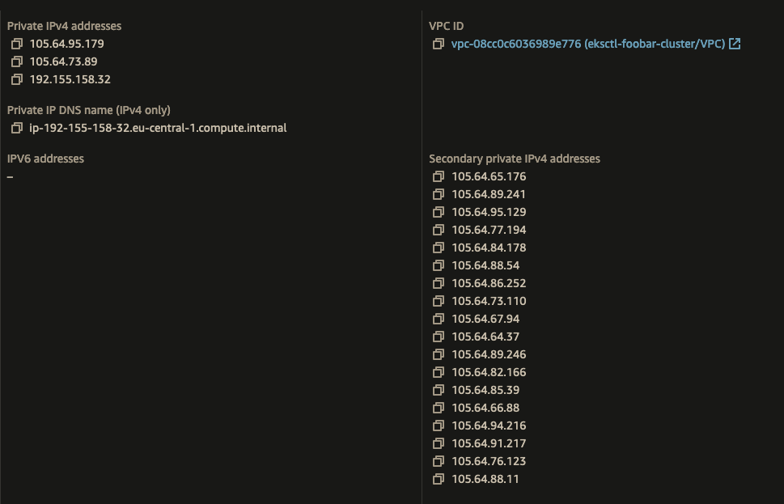

# 2. AWS VPC CNI & ENIConfig configuration for Custom Networking


### AWS-Node and CNI Configuration
```bash
# Get the current env vars of aws-node
kubectl get daemonset aws-node -n kube-system -o jsonpath='{.spec.template.spec.containers[0].env}' | jq -r '.[] | .name + "=" + .value'

# Enable custom network config in aws-node
kubectl set env daemonset aws-node -n kube-system AWS_VPC_K8S_CNI_CUSTOM_NETWORK_CFG=true

kubectl set env daemonset aws-node -n kube-system ENI_CONFIG_LABEL_DEF=topology.kubernetes.io/zone

```
####  Environment Variables Explained

- `kube-system ENI_CONFIG_LABEL_DEF=topology.kubernetes.io/zone`: 
    - Means that AWS CNI is using the _topology.kubernetes.io/zone_ label to determine the `ENIConfig` name(`kubectl get eniconfig`) for that node. 
    - _topology.kubernetes.io/zone_ label is automatically added to the nodes by the kubelet as `eu-west-1a` or `eu-west-1b` or `eu-west-1c`, so we don't need any extra node tagging to do.
    - This way we have a consistent way of applying the ENIConfig to the nodes.
    - `ENIConfig` has the info about which Subnet and Security Groups should be used for the ENI.
    - Our nodes will have their 1st ENI configured with the default VPC CIDR block, and the 2nd ENI will be configured with the Secondary CIDR block.
    - Pods get their IPs from 2nd ENI, and the 1st ENI is used for the node communication.
    - We will have 1st ENI reserved for pods, and all other ENIs will be used for the pod communication and in the Secondary CIDR block.
- `AWS_VPC_K8S_CNI_CUSTOM_NETWORK_CFG=true`: 
    - AWS CNI will use the `ENIConfig` objects which we create to configure the ENIs.
    - Means that we are enabling custom networking on the CNI level. This change will help us to use the secondary CIDR block for the pods.
    - This configuration **requires the existing node EC2 Instances be be restarted to take effect**.

### ENIConfig k8s CRDs
- ENIConfig CRD is used by AWS CNI to create ENIs with the specified configuration for that Availability Zone.
- The deamonset `aws-node` has env. var. called `ENI_CONFIG_LABEL_DEF`, and it is used to match
    ```
    NodeLabels:
        topology.kubernetes.io/zone=eu-west-1a
        ...

    AWS CNI makes the following configuration 
        (selected ENIConfig name for node) = NodeLabels[ENI_CONFIG_LABEL_DEF]
    ```
- We are informing AWS CNI to look for the node label `topology.kubernetes.io/zone`. 
    - For example, if the label value is `eu-west-1a`, AWS CNI will use the `ENIConfig` named `eu-west-1a`.

#### Let's create the ENIConfig objects
```bash
cat << EOF | kubectl apply -f -
apiVersion: crd.k8s.amazonaws.com/v1alpha1
kind: ENIConfig
metadata:
 name: $AZ1
spec:
  securityGroups: ["$CLUSTER_SECURITY_GROUP_ID"]
  subnet: "$CUST_SNET1"
EOF

cat << EOF | kubectl apply -f -
apiVersion: crd.k8s.amazonaws.com/v1alpha1
kind: ENIConfig
metadata:
 name: $AZ2
spec:
  securityGroups: ["$CLUSTER_SECURITY_GROUP_ID"]
  subnet: "$CUST_SNET2"
EOF

cat << EOF | kubectl apply -f -
apiVersion: crd.k8s.amazonaws.com/v1alpha1
kind: ENIConfig
metadata:
 name: $AZ3
spec:
  securityGroups: ["$CLUSTER_SECURITY_GROUP_ID"]
  subnet: "$CUST_SNET3"
EOF

kubectl get eniconfig ${AZ1} -o yaml; echo "---";
kubectl get eniconfig ${AZ2} -o yaml; echo "---";
kubectl get eniconfig ${AZ3} -o yaml; echo "---";
```


### Restart the Node Group Instances

- Terminate the Node Group instances to have them recreated with the new ENI configuration.
- After you create the Node Group, **check the instances to see if they got their IP Addresses from VPC Secondary CIDR Block**
- 


### Test Pods having IP addresses from Secondary CIDR Block

```bash
kubectl create deployment nginx --image=nginx
kubectl scale --replicas=5 deployments/nginx
kubectl expose deployment/nginx --type=NodePort --port 80

# try to see if the pods are running on the secondary CIDR block (ignore daemonset pods)
kubectl get pods -o wide

kubectl port-forward svc/nginx 8000:80
# check localhost:8000 on browser
```